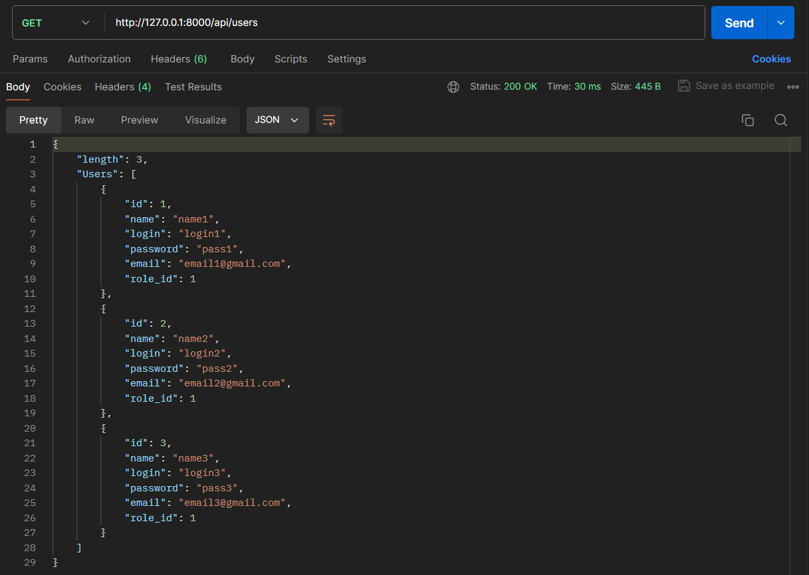
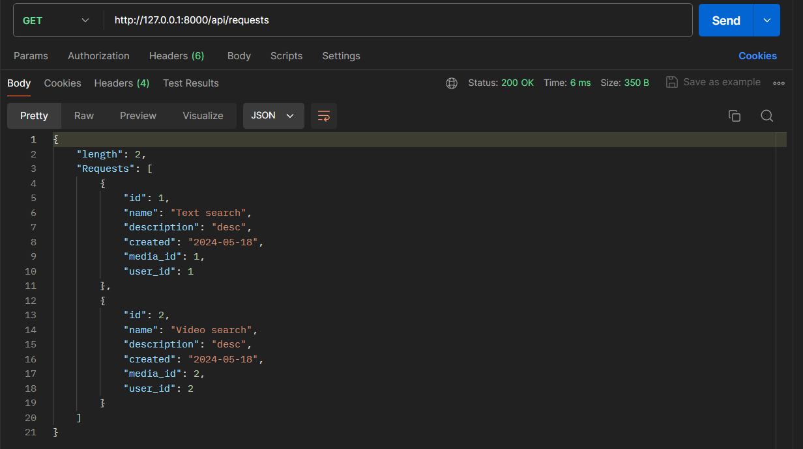
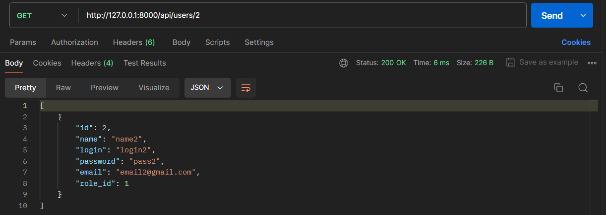
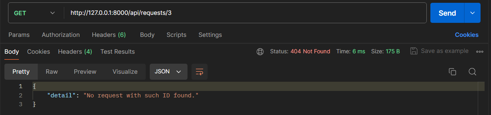
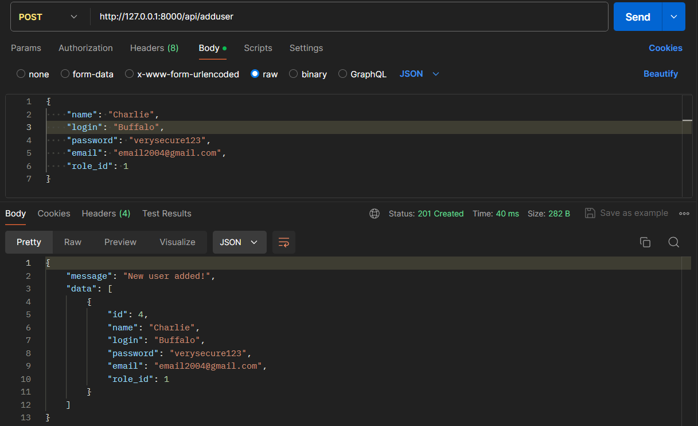
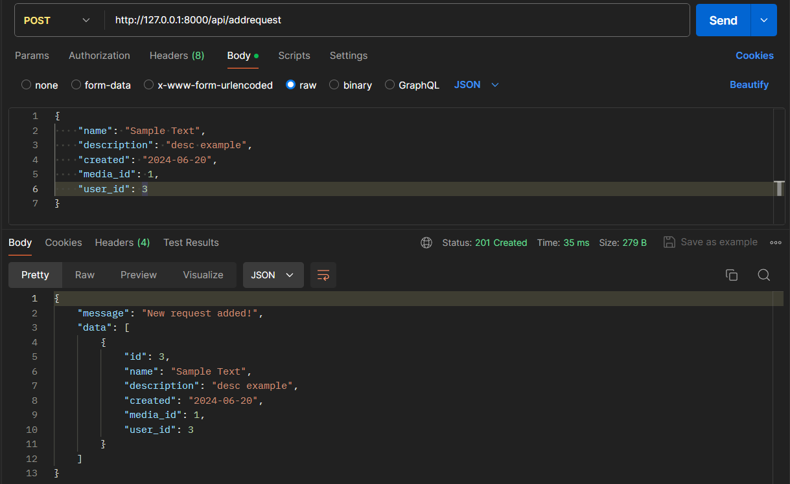
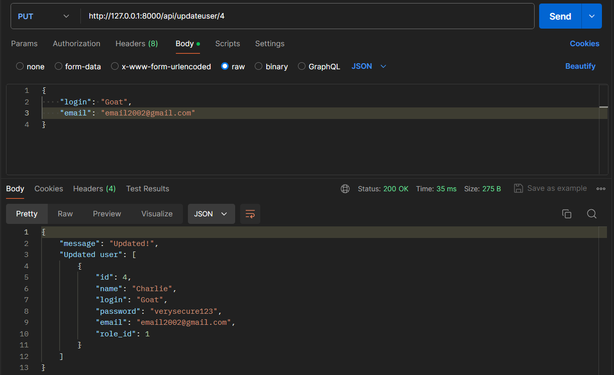
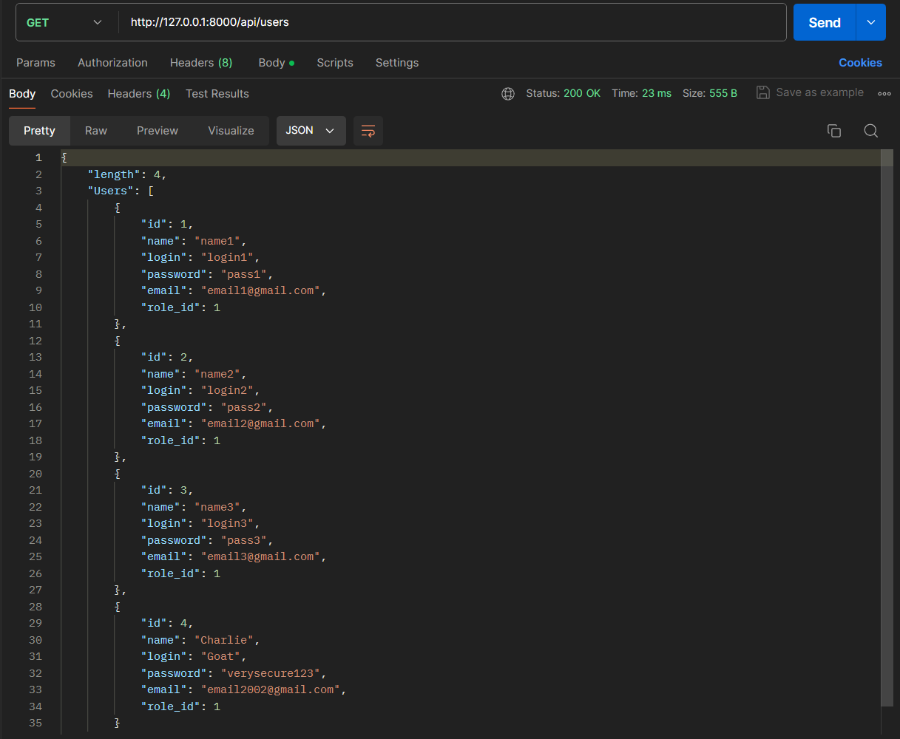
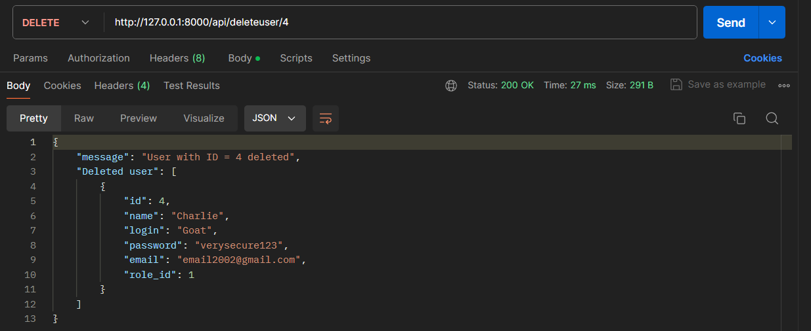
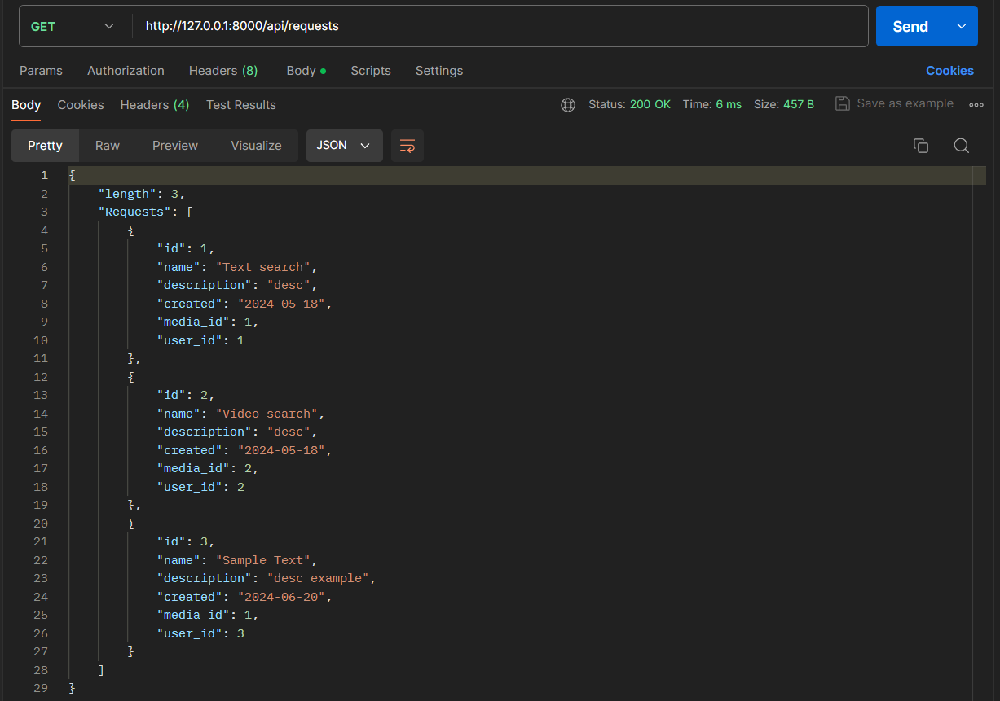

# Тестування працездатності системи

## Надсилання запитів з використанням REST API

### GET

#### Відображення усіх даних:

#### Пошук об'єктів за ідентифікатором:

Exception приклад:

### POST 

#### Створення нових позицій:

### PUT

#### Оновлення даних:

#### Після запиту:

### DELETE

#### Відправили запит на видалення користувача:

#### Результат:

